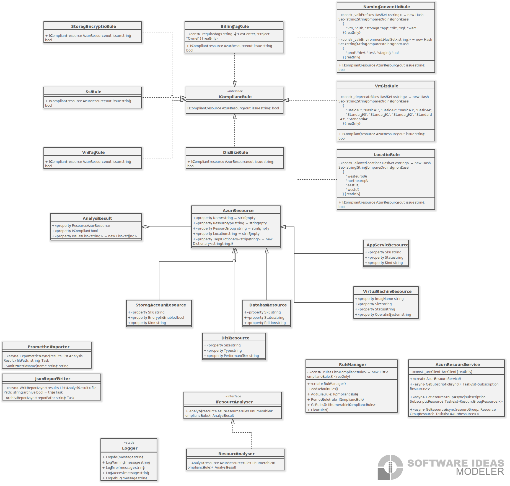

# Azure Resource Analyzer

Narzędzie do inwentaryzacji, analizy i raportowania stanu zasobów chmurowych Azure.

## Opis projektu

Azure Resource Analyzer to aplikacja w języku C# (.NET 8), która umożliwia:

- **Pobieranie danych** o zasobach chmurowych z subskrypcji Azure przy użyciu Azure SDK (maszyny wirtualne, storage, app service, bazy danych, dyski)
- **Analizę zgodności** zasobów z regułami, które można samodzielnie definiować (np. VM bez tagów „env", VM starego typu, storage bez szyfrowania)
- **Generowanie raportów** w formacie JSON i eksport metryk do systemów monitoringu (Prometheus/Grafana)

Projekt symuluje narzędzie stosowane w dużych środowiskach chmurowych do automatycznej kontroli i raportowania zasobów.

## Wymagania

- .NET 8 SDK
- Subskrypcja Azure z odpowiednimi uprawnieniami
- Skonfigurowane uwierzytelnianie Azure (DefaultAzureCredential)

## Instalacja

1. Sklonuj repozytorium:
```bash
git clone https://github.com/Mqardasz/AzureResourceAnalyser.git
cd AzureResourceAnalyser
```

2. Przywróć zależności NuGet:
```bash
dotnet restore
```

3. Zbuduj projekt:
```bash
dotnet build
```

## Konfiguracja uwierzytelniania Azure

Aplikacja używa `DefaultAzureCredential`, która obsługuje następujące metody uwierzytelniania (w kolejności):

1. **Environment Variables** - zmienne środowiskowe:
   - `AZURE_TENANT_ID`
   - `AZURE_CLIENT_ID`
   - `AZURE_CLIENT_SECRET`

2. **Managed Identity** - dla aplikacji uruchomionych w Azure
3. **Visual Studio** - uwierzytelnianie z Visual Studio
4. **Azure CLI** - zaloguj się przez `az login`
5. **Azure PowerShell** - zaloguj się przez `Connect-AzAccount`

### Przykład konfiguracji przez Azure CLI:
```bash
az login
```

### Przykład konfiguracji przez zmienne środowiskowe:
```bash
export AZURE_TENANT_ID="twój-tenant-id"
export AZURE_CLIENT_ID="twój-client-id"
export AZURE_CLIENT_SECRET="twój-client-secret"
```

## Uruchomienie

```bash
cd AzureResourceAnalyser
dotnet run
```

## Funkcjonalności

### 1. Pobieranie zasobów z Azure

Aplikacja automatycznie pobiera następujące typy zasobów:
- Maszyny wirtualne (Virtual Machines)
- Dyski (Disks)
- Konta magazynowania (Storage Accounts)
- App Services
- Bazy danych (SQL Databases)

### 2. Reguły zgodności

Domyślnie zaimplementowane i aktywne reguły:

- **VmTagRule** - sprawdza czy maszyna wirtualna ma wymagany tag "env"
- **VmSizeRule** - wykrywa przestarzałe rozmiary VM (Basic_A*, Standard_A0-A4)
- **DiskSizeRule** - sprawdza typ wydajności dysków (Standard_LRS)
- **StorageEncryptionRule** - weryfikuje czy storage ma włączone szyfrowanie
- **SshRule** - sprawdza dostępność SSH dla maszyn Linux

Dodatkowe reguły (opcjonalne, można włączyć w RuleManager):

- **BillingTagRule** - sprawdza obecność tagów rozliczeniowych (CostCenter, Project, Owner)
- **LocationRule** - weryfikuje czy zasoby są w dozwolonych regionach Azure
- **NamingConventionRule** - sprawdza konwencję nazewnictwa zasobów (format: [typ]-[env]-[nazwa]-[numer])

Aby włączyć opcjonalne reguły, odkomentuj odpowiednie linie w klasie `RuleManager.cs`.

### 3. Dynamiczne dodawanie reguł

Możesz dodawać własne reguły implementując interfejs `IComplianceRule`:

```csharp
public class MyCustomRule : IComplianceRule
{
    public bool IsCompliant(AzureResource resource, out string issue)
    {
        issue = string.Empty;
        
        // Twoja logika sprawdzania zgodności
        if (/* warunek niezgodności */)
        {
            issue = "Opis problemu";
            return false;
        }
        
        return true;
    }
}
```

Następnie dodaj regułę do RuleManager:

```csharp
var ruleManager = new RuleManager();
ruleManager.AddRule(new MyCustomRule());
```

### 4. Raporty

Aplikacja generuje dwa typy raportów:

#### Raport JSON (`analysis_report.json`)
Zawiera:
- Timestamp analizy
- Liczba zasobów (całkowita, zgodnych, niezgodnych)
- Szczegółowe wyniki analizy dla każdego zasobu
- Lista wykrytych problemów

Raporty są automatycznie archiwizowane w folderze `reports_archive/` z timestampem.

#### Metryki Prometheus (`prometheus_metrics.txt`)
Format zgodny z Prometheus/Grafana:
- `azure_resources_total` - całkowita liczba zasobów
- `azure_resources_compliant` - liczba zgodnych zasobów
- `azure_resources_noncompliant` - liczba niezgodnych zasobów
- `azure_resources_by_type_*` - liczba zasobów według typu
- `azure_resources_compliant_*` - zgodność według typu zasobu

### 5. Logowanie

Aplikacja wykorzystuje logowanie w konsoli:
-  **[INFO]** - general (zielony)
-  **[WARNING]** - warning (żółty)
-  **[ERROR]** - error (czerwony)
-  **[SUCCESS]** - operacje zakończone sukcesem (cyjan)
-  **[DEBUG]** - debug (szary)

### 6. Statystyki

Po zakończeniu analizy wyświetlane są:
- Łączna liczba zasobów
- Liczba zasobów zgodnych i niezgodnych
- Wskaźnik zgodności (%)
- Statystyki według typu zasobu
- Czas wykonania analizy

## Struktura projektu

```
AzureResourceAnalyser/
├── Models/                      # Modele danych
│   ├── AzureResource.cs        # Klasa bazowa dla zasobów
│   ├── VirtualMachineResource.cs
│   ├── DiskResource.cs
│   ├── StorageAccountResource.cs
│   ├── AppServiceResource.cs
│   ├── DatabaseResource.cs
│   └── AnalysisResult.cs       # Wynik analizy zasobu
├── Services/                    # Serwisy
│   ├── AzureResourceService.cs # Pobieranie zasobów z Azure
│   └── RuleManager.cs          # Zarządzanie regułami zgodności
├── Analyzers/                   # Analizatory
│   ├── IResourceAnalyser.cs
│   └── ResourceAnalyser.cs     # Główny analizator zasobów
├── Rules/                       # Reguły zgodności
│   ├── IComplianceRule.cs      # Interfejs reguły
│   ├── VmTagRule.cs            # Sprawdzanie tagów VM
│   ├── VmSizeRule.cs           # Wykrywanie starych rozmiarów VM
│   ├── DiskSizeRule.cs         # Sprawdzanie wydajności dysków
│   ├── StorageEncryptionRule.cs # Weryfikacja szyfrowania
│   ├── SshRule.cs              # Sprawdzanie SSH dla Linux
│   ├── BillingTagRule.cs       # Tagi rozliczeniowe (opcjonalna)
│   ├── LocationRule.cs         # Dozwolone regiony (opcjonalna)
│   └── NamingConventionRule.cs # Konwencja nazw (opcjonalna)
├── Reporting/                   # Generowanie raportów
│   ├── JsonReportWriter.cs
│   └── PrometheusExporter.cs
├── Utils/                       # Narzędzia pomocnicze
│   └── Logger.cs               # Kolorowe logowanie
└── Program.cs                   # Punkt wejścia aplikacji
```

## Stack technologiczny

- **Język**: C# (.NET 8)
- **Azure SDK**: 
  - Azure.ResourceManager
  - Azure.Identity
  - Azure.ResourceManager.Compute
  - Azure.ResourceManager.Storage
  - Azure.ResourceManager.AppService
- **Serializacja**: System.Text.Json
- **Raportowanie**: JSON, Prometheus metrics format
- **Platforma**: Windows / Linux / macOS

## Przykładowe wyjście

```
[INFO] === Azure Resource Analyzer - Start ===
[INFO] Narzędzie do inwentaryzacji i analizy zasobów Azure

[INFO] Połączono z Azure przy użyciu DefaultAzureCredential
[INFO] Inicjalizacja menedżera reguł zgodności...
[SUCCESS] Załadowano 5 reguł zgodności

[INFO] Pobieranie subskrypcji Azure...
[INFO] Znaleziono subskrypcję: My Subscription (ID: xxxx-xxxx-xxxx)

[INFO] Przetwarzanie subskrypcji: My Subscription
[INFO] Znaleziono 3 grup zasobów
[INFO]   Analiza grupy zasobów: rg-production
[INFO]     Znaleziono 5 zasobów
[WARNING]     ⚠ Niezgodność: vm-web-01
[WARNING]       - Maszyna wirtualna nie ma wymaganego tagu 'env'.

[INFO] Generowanie raportów...
[SUCCESS] Raport zapisany pomyślnie: /path/to/analysis_report.json
[INFO] Raport zarchiwizowany: /path/to/reports_archive/analysis_report_20260117_123045.json
[SUCCESS] Metryki Prometheus zapisane: /path/to/prometheus_metrics.txt

[INFO] ==========================================
[INFO]          STATYSTYKI ANALIZY
[INFO] ==========================================
Łączna liczba zasobów:     15
Zasoby zgodne:             12
Zasoby niezgodne:          3
Wskaźnik zgodności:        80.00%

[INFO] Zasoby według typu:
  Microsoft.Compute/virtualMachines:
    Zgodne: 4, Niezgodne: 1
  Microsoft.Compute/disks:
    Zgodne: 5, Niezgodne: 2
  Microsoft.Storage/storageAccounts:
    Zgodne: 3, Niezgodne: 0

[INFO] Czas wykonania: 5.43 sekund
[SUCCESS] Analiza zakończona pomyślnie!
```


## Diagram UML




## Autor

Mqardasz - projekt na przedmiot Programowanie w środowisku Windows
